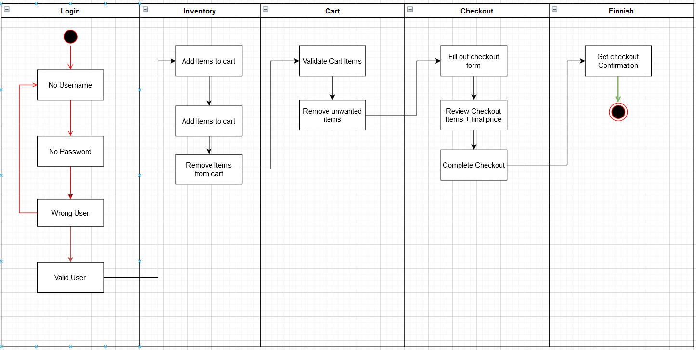

# ULTRA.IO UI - Automation Test

This is Automated test which was build to test https://www.saucedemo.com/ eCommerce site UI Functionality using cypress as javascript framework.

In this project E2E test were develop in order to automate the Login and Purchase Flow functionality. 



List of Test Scenarios:  

## Getting Started

These instructions will get you a copy of the project up and running on your local machine for testing purposes.

## Installing

#### Clone repo

```
git clone https://github.com/XFaramirX/ultraUIautomation
```

#### Install dependencies

```
yarn install
```

## How to run tests:

#### Command interface

```
yarn cypress:run
```

#### View and Generate Report

You can view the lastest report at: URL

Or you can generate a new one in your local host.

```
yarn cypress:report
```

This command will execute create a detail report using htmlextra reporter inside **/newman** folder.

You can launch the report using VScode "live-server" plugin.
See example: 

#### Run in Docker

Run below command to pull docker image

```
docker pull cypress/included:8.3.0
```

Run collection

Run collection inside docker and update live report.

```
yarn docker:run
```

## Reporting

You can find the latest **LIVE REPORT Here** : 

Reporting Tools used:

**Allure Report**
https://github.com/Shelex/cypress-allure-plugin


## Author

- **Jose David Barrera - Colombia**

#### License

This project is licensed under the MIT License - see the [LICENSE.md](LICENSE.md) file for details.
